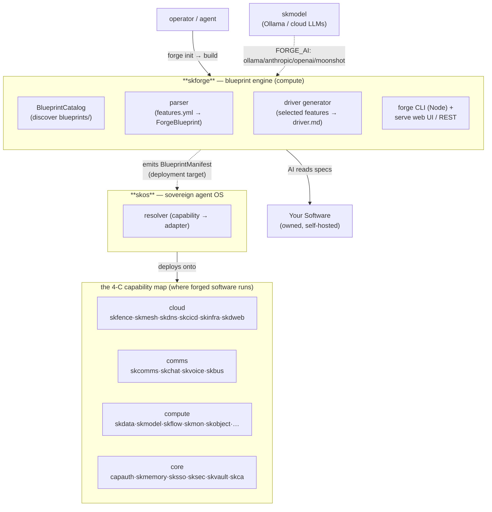
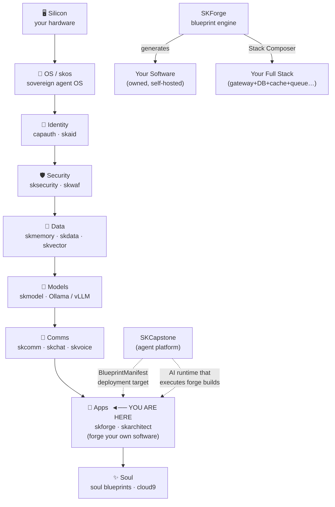

# 🔧 SKForge

### Don't use software. Forge your own.

**AI-native software blueprints that generate complete, production-ready software in any language.**

Pick your category. Choose your features. Select your language. Let AI build it.

**Free. Forever.** A [smilinTux](https://github.com/smilinTux) Open Source Project by smilinTux.

*Making Self-Hosting & Decentralized Systems Cool Again* 🐧

---

## ⏱️ The 60-second version

SKForge ships **structured specification files** (blueprints) for whole categories of
software — load balancers, databases, API gateways, vector stores, sovereign agent
SDKs, and more. A blueprint is a feature catalog (`features.yml`) + an architectural
spec (`BLUEPRINT.md`) + test specs + memory/deployment profiles. You pick the features
you want, pick a target language, and hand the bundle to **any** LLM — it generates a
complete, tested implementation.

Two surfaces ship it:

- a **zero-dependency Node CLI** (`forge`) — the human/agent front door (`onboard`,
  `init`, `build`, `list`, `info`, `search`, `stack`, `serve`, `new`, `contribute`);
- a **tiny Python engine** (`skforge` on PyPI, `pydantic` + `pyyaml` only) — the
  programmatic API: parse a blueprint, resolve a feature dependency graph, and emit a
  `driver.md` build spec.

There are currently **30 blueprints** in [`blueprints/`](./blueprints). The forge
generates code; **the code is yours** (Apache-2.0). It runs on your hardware, your
terms. The cloud is just someone else's computer — forge your own.

---

## Install

Runtime: **Node ≥22**.

```bash
npm install -g skforge
# or: pnpm add -g skforge

forge onboard
```

Or via shell:
```bash
curl -fsSL https://skforge.io/install.sh | sh
```

---

## 🐧 What is SKForge?

SKForge provides **detailed, structured specification files** (blueprints) that any LLM — even mid-tier models — can consume to generate complete, working, tested software products.

Think of it as **"Skills for Software"** — instead of teaching an AI how to use a tool, you give it the recipe to **build the tool from scratch**.

### The Problem

- Developers waste months reinventing load balancers, web servers, auth systems, message queues
- AI can code, but needs structured guidance to produce production-grade software
- Enterprise software is bloated — 90% of features go unused
- Open source projects are complex — hard to customize without deep expertise

### The Solution

```
📋 Pick a blueprint     →  Load Balancer, Database, API Gateway...
✅ Choose your features  →  TLS? Rate limiting? WebSocket? You decide.
🦀 Select your language  →  Rust, Go, Python, Java, .NET, Zig...
🔨 Forge it             →  AI reads specs → builds → tests → ships
```

---

## 🚀 Quick Start

### 1. Pick a Blueprint

Browse the [`blueprints/`](./blueprints) directory for your software category.

### 2. Create Your `driver.md`

```markdown
# driver.md — My Custom Load Balancer

## Blueprint
category: load-balancers

## Language
target: rust

## Features
- [x] HTTP/1.1 & HTTP/2
- [x] Health checks
- [x] Round-robin balancing
- [x] TLS termination
- [x] Rate limiting
- [x] Prometheus metrics
- [ ] gRPC support          # Don't need this
- [ ] WebSocket support     # Skip for now
```

### 3. Feed to Any LLM

```
"Read this driver.md and the referenced blueprint specs.
Generate a complete implementation that passes all specified tests."
```

### 4. Get Production-Ready Code

The AI generates complete source code with:
- ✅ All selected features implemented
- ✅ Unit tests passing
- ✅ Integration tests passing
- ✅ Benchmarks meeting baseline targets
- ✅ Documentation generated

---

## 🐍 Python Engine (programmatic API)

For automation, the Python package gives you the same blueprint model without the CLI:

```bash
pip install -e .          # or: pip install skforge
```

```python
from skforge import BlueprintCatalog, generate_driver

catalog = BlueprintCatalog("./blueprints")
print(catalog.count(), "blueprints:", catalog.list())

bp = catalog.get("sovereign-agent-sdk")
# resolve a selection + its transitive dependencies
features = bp.resolve_features(["agent-class", "remember-api"])
# render a build spec the AI can consume
driver_md = generate_driver(bp, features)
```

The engine: discovers blueprints (`BlueprintCatalog`), parses `features.yml` into
typed `ForgeBlueprint`/`FeatureGroup`/`Feature` models (`parser`), resolves the feature
dependency graph, topo-sorts an implementation order, and renders `driver.md`
(`driver.generate_driver`).

---

## 🧩 The pieces

| Piece | What it is |
|---|---|
| **`blueprints/`** | the catalog — 30 software categories, each a feature catalog + spec + tests + profiles |
| **`forge` CLI** (`forge.mjs`) | zero-dep Node ≥22 front door: `onboard·init·build·list·info·search·stack·serve·new·contribute` |
| **`forge build`** | loads driver + blueprint context, detects an AI provider, drives generation |
| **`forge stack`** | Stack Composer — compose a full vertical from multiple blueprints (`saas-starter`, `ai-platform`, `enterprise`, …) |
| **`forge serve`** (`cli/serve.mjs`) | web UI + REST marketplace (`/api/blueprints`, `/api/search`, `/api/generate-driver`) |
| **`skforge` (Python)** | `BlueprintCatalog` + `parser` + `driver` — programmatic parse / resolve / generate |
| **`RECON.md`** | the recipe for making recipes — research a category into a new blueprint |
| **`STACKS.md`** | full Stack Composer documentation |

---

## 📦 Blueprint Categories

### Tier 1 — Available Now
| Category | Blueprint | Features |
|----------|-----------|----------|
| 🔀 Load Balancers | [`blueprints/load-balancers/`](./blueprints/load-balancers/) | 80+ features |
| 🌐 Web Servers | [`blueprints/web-servers/`](./blueprints/web-servers/) | 70+ features |
| 🗄️ Databases (Relational) | [`blueprints/databases/`](./blueprints/databases/) | 90+ features |
| 📨 Message Queues | [`blueprints/message-queues/`](./blueprints/message-queues/) | 75+ features |
| 🚪 API Gateways | [`blueprints/api-gateways/`](./blueprints/api-gateways/) | 85+ features |

### Coming Soon
Key-Value Stores • Search Engines • Auth Systems • Caching Layers • Container Runtimes • DNS Servers • Email Servers • File Storage • Log Aggregators • Monitoring Systems • CI/CD Pipelines • VPN Servers • Network Proxies • Service Meshes • Stream Processors • Time-Series DBs • Schedulers • Secret Managers • Rate Limiters • Package Managers

---

## 🏗️ How Blueprints Work

Each blueprint contains:

```
blueprints/load-balancers/
├── BLUEPRINT.md           # Master architectural specification
├── features.yml           # Exhaustive feature catalog (pick & choose)
├── architecture.md        # System design patterns & data flows
├── tests/
│   ├── unit-tests.md      # Required unit test specifications
│   ├── integration-tests.md
│   └── benchmarks.md      # Performance baselines
├── memory-profiles/
│   ├── embedded.md        # IoT/embedded (< 64MB RAM)
│   ├── standard.md        # Server (1-8GB RAM)
│   └── enterprise.md      # High-memory (8GB+ RAM)
├── deployment/
│   ├── docker.md
│   ├── kubernetes.md
│   └── bare-metal.md
└── references/
    ├── opensource-top10.md # Top 10 OSS products analyzed
    └── proprietary-top10.md
```

---

## 🏗️ Stack Composer — Forge Your Entire Stack

Why build one component when you can forge the whole thing?

```bash
# Preview a pre-built stack template
forge stack ai-platform

# Templates available:
#   saas-starter    — Gateway + Web + DB + Cache + Queue
#   ai-platform     — Gateway + DB + Vectors + Graph + Queue + Storage
#   enterprise      — Full 9-layer production stack
#   notion-killer   — Gateway + Web + DB + Search + Storage + Realtime
#   zero-trust      — Gateway + Secrets + DB + Vectors + Graph + Storage

# Or define your own stack.yml
forge stack my-stack.yml
```

Pick one blueprint per layer. Define how they connect. Generate the entire integrated stack — database, cache, search, API gateway, auth, deployment configs — in one command. See **[STACKS.md](./STACKS.md)** for full documentation.

---

## 🔍 RECON — Create Blueprints for ANY Software

Want to blueprint a new software category? We wrote the guide:

**[RECON.md](./RECON.md)** — The Recipe for Making Recipes

Any AI (or human) can follow this step-by-step process to:
1. Research the top 30 products (OSS + proprietary + SaaS)
2. Extract every feature into a master catalog
3. Document the architecture patterns
4. Write test specifications
5. Create memory/hardware profiles

**It's reverse engineering without copying code.** We document patterns, not source. The AI writes fresh code from the specs. Royalty-free. 100% legal.

> *Copy-paste the quick-start prompt from RECON.md into any AI and point it at a software category. Instant blueprint.*

---

## 🤝 Contributing

We welcome contributions! Here's how:

- **New Blueprints:** Follow [RECON.md](./RECON.md) to research and blueprint any software category
- **New Features:** Add features to existing `features.yml` files
- **New Categories:** Create a new blueprint directory following the template
- **Improvements:** Enhance architectural guidance, test specs, or memory profiles
- **Translations:** Help make blueprints accessible in more languages

See [CONTRIBUTING.md](./CONTRIBUTING.md) for details.

---

## 📜 License

**Dual License — Anti-Predator + User Freedom:**

- **Forge CLI & Tooling:** [AGPL-3.0](./LICENSE) — Ensures the forge stays free forever. If you modify it and run it as a service, you MUST share your changes. Protects against corporate capture.
- **Blueprints (generated code):** Apache 2.0 — The software YOU generate from our blueprints is YOURS. No strings. Commercial, personal, nonprofit — do whatever you want.

*Why?* We want to protect the ecosystem from legal predators while giving YOU maximum freedom with your generated code.

---

## 🌍 Philosophy

> **"We don't sell software. We give everyone the blueprints to build their own."**

Software companies charge millions for products built from the same patterns. Those patterns can be documented, cataloged, and handed to AI to rebuild from scratch — custom, lean, no bloat, no vendor lock-in.

As AI models improve, the same blueprints produce better software. **Future-proof by design.**

---

## 🧭 Where it lives in SKStack v2

SKForge sits in the **compute** band of the SKWorld 4-C capability map — it is the
**construction tool** of the ecosystem. It does not run services; it produces the
*software* that the other capabilities run. You forge a blueprint into code; skos
deploys that code; the 4 C's operate it.

SKForge is deliberately **loosely coupled**: the engine has only two Python deps
(`pydantic`, `pyyaml`) and the CLI is zero-dependency Node ≥22. It is *ecosystem-aware*
(it can emit a `skcapstone` `BlueprintManifest` as a deployment target — see
`src/skforge/__init__.py`) but imports nothing from the rest of the stack at runtime.
That's by design: forge first, deploy later.



**The only live dependency** is the AI provider that does the actual code generation —
resolved through the same model surface the rest of SKWorld uses (`skmodel` → Ollama,
or cloud keys). Everything else is a *target*, not a runtime coupling.

For the full data flow, the parse/resolve/generate pipeline, and the source map, see
**[docs/ARCHITECTURE.md](docs/ARCHITECTURE.md)**.

---

## 🏠 Self-Host Everything

SKForge is built for the **self-hosting revolution**. Every blueprint generates software you own, run, and control — on your hardware, your terms, your rules.

No more:
- 📉 Price hikes you can't control
- 🔒 Vendor lock-in you can't escape
- 📊 Data harvesting you didn't consent to
- 💀 Services sunsetting and killing your workflow

**Your infrastructure. Your data. Your software. Forged by you.**

> *"The cloud is just someone else's computer. Forge your own."*

---

## First Principles & The Full Vertical

> **Get back to first principles.**
> Developers waste years renting software — SaaS subscriptions, vendor lock-in, black-box middle layers. The patterns that power every load balancer, every API gateway, every database are documentable. SKForge documents them, then hands them to AI so you can build your own.
>
> **Own the full vertical** — silicon, OS, identity, data, models, security, comms, apps, soul. Every layer open. Every layer swappable. Every layer **yours**.

**SKForge is your Apps layer.** Don't rent SaaS — forge your own software. Every blueprint generates code that runs on your hardware under your terms. No price hikes, no sunsetting, no vendor extracting rent from patterns that were always public. The cloud is just someone else's computer. Forge your own.

### Where SKForge sits in the vertical



### SKCapstone alignment

SKForge is a **loosely coupled but ecosystem-aware** layer — it sits at the Apps tier of the vertical and is independent enough to be used standalone, but aware of the SKCapstone deployment target.

The evidence:

- `src/skforge/__init__.py` documents SKForge's role as converting blueprints into `skcapstone BlueprintManifest` for deployment — making SKCapstone the natural runtime that executes forge builds.
- The Stack Composer templates (`zero-trust`, `ai-platform`, `enterprise`) map directly to the SKCapstone vertical layers — generate the infrastructure, then hand it to SKCapstone agents to run it.
- The philosophy is identical: no vendor lock-in, no cloud landlord, your hardware, your rules. SKForge generates the software; the rest of the vertical (skmemory, cloud9, skcapstone) runs it.
- Unlike skmemory or skvoice, SKForge does not import SKCapstone at runtime — it's the **construction layer**, not the **runtime layer**. You forge the software first; the SKCapstone ecosystem runs it.

**Sovereignty isn't a feature — it's the foundation.** Own the full vertical. 🐧

---

**Making Self-Hosting & Decentralized Systems Cool Again** 🐧

Built with ❤️ by [smilinTux](https://github.com/smilinTux) | [smilinTux](https://smilintux.org) — *Helping architect our quantum future, one smile at a time.*

**The Penguin Kingdom** — Cool Heads. Warm Justice. Smart Systems. 👑

---

Part of the **[SKWorld](https://skworld.io)** sovereign ecosystem · site:
**[skforge.io](https://skforge.io)** · `curl -fsSL https://skforge.io/install.sh | sh` · 🐧 smilinTux
