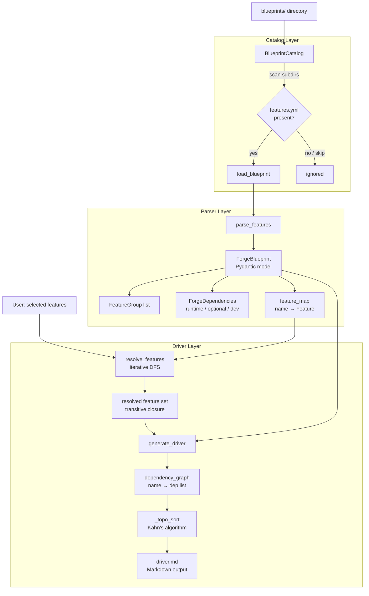

# SKForge

[](https://pypi.org/project/skforge/)
[](https://www.npmjs.com/package/skforge)
[](https://github.com/smilinTux/skforge/blob/main/LICENSE)
[](https://pypi.org/project/skforge/)

**SKForge** is the Python engine for the Sovereign Skills blueprint ecosystem — a feature-driven code generation system that turns structured `features.yml` catalogs and `BLUEPRINT.md` specifications into focused `driver.md` build manifests. It parses blueprint directories, resolves transitive feature dependencies via topological sort, and generates ordered implementation plans that tell an AI code generator exactly which features to build and in what sequence. Think of it as "Skills for Software": instead of teaching an AI how to use a tool, you give it the recipe to build the tool from scratch, lean and without vendor lock-in.

---

## Install

**Python (library + skill tools):**

```bash
pip install skforge
```

**npm (CLI tooling):**

```bash
npm install -g skforge
# or
pnpm add -g skforge
```

> Python requirements: 3.10 or later. Runtime dependencies: `pydantic>=2.0,<3.0`, `pyyaml>=6.0,<7.0`.

---

## Architecture



**Data flow in four steps:**

1. **Catalog** — `BlueprintCatalog` scans a `blueprints/` directory tree, discovers every subdirectory that contains a `features.yml`, and maintains a lazy-loaded, cached index by slug.
2. **Parse** — `parse_features` / `load_blueprint` deserialize the YAML catalog (and optional `BLUEPRINT.md` prose) into typed Pydantic models (`ForgeBlueprint`, `FeatureGroup`, `Feature`, `ForgeDependencies`).
3. **Resolve** — `ForgeBlueprint.resolve_features` expands a caller-supplied selection into its full transitive closure by iteratively walking the dependency graph declared in each `Feature.dependencies` list.
4. **Generate** — `generate_driver` topologically sorts the resolved features (dependencies first) and renders a human-readable, AI-consumable `driver.md` markdown document with complexity annotations and an implementation order.

---

## Features

- **Blueprint discovery** — scans a directory tree and auto-discovers any subdirectory containing `features.yml`; silently skips `TEMPLATE/`, `__pycache__/`, `.git/`, and `node_modules/`.
- **Typed Pydantic v2 models** — `Feature`, `FeatureGroup`, `ForgeBlueprint`, and `ForgeDependencies` give IDE-friendly, validated access to all blueprint data.
- **Transitive dependency resolution** — iterative depth-first expansion ensures every declared dependency of a selected feature is automatically pulled in, no matter how deep the chain.
- **Topological sort** — `generate_driver` orders features so dependencies are always implemented before the features that require them; cycles are handled gracefully (appended last, alphabetically).
- **Default feature sets** — blueprints declare sensible defaults (`default: true`); callers that pass no selection get a working minimal build automatically.
- **Complexity annotations** — each feature carries a `complexity` field (`low` / `medium` / `high`) surfaced in the generated driver for effort estimation.
- **BLUEPRINT.md passthrough** — optional prose documentation is carried through in `ForgeBlueprint.blueprint_md` for downstream consumers.
- **Lazy-loading catalog cache** — `BlueprintCatalog` parses each blueprint on first access and caches it; `reload()` clears all caches for live-reload scenarios.
- **Full-text search** — `BlueprintCatalog.search(query)` performs case-insensitive substring matching against slug, name, and description.
- **Dual YAML dependency format** — dependency lists accept plain PEP 508 strings (`"pydantic>=2.0"`) or dicts (`{pydantic: ">=2.0"}`); both are normalized transparently.
- **Nine built-in blueprint categories** — ships with catalogs for API gateways, databases, key-value stores, load balancers, message queues, object storage, search engines, vector databases, and web servers.
- **Skill tools** — `skill.yaml` exposes `forge_generate`, `forge_list_blueprints`, and `forge_catalog` for sovereign skills-compatible agents and MCP hosts.

---

## Usage

### Python API

#### Load the catalog and list blueprints

```python
from skforge import BlueprintCatalog

catalog = BlueprintCatalog("./blueprints")

print(catalog.count(), "blueprints available")

for slug in catalog.list():
    print(slug)
# api-gateways
# databases
# key-value-stores
# load-balancers
# message-queues
# object-storage
# search-engines
# vector-databases
# web-servers
```

#### Inspect a blueprint

```python
bp = catalog.get("load-balancers")

print(bp.name)                 # human-readable name from features.yml
print(bp.slug)                 # "load-balancers"
print(bp.version)              # "1.0.0"
print(len(bp.all_features))    # total feature count across all groups
print(bp.default_features)     # names of features with default: true

for group in bp.groups:
    print(f"\n[{group.name}] — {group.description}")
    for feat in group.features:
        marker = "*" if feat.default else " "
        print(f"  [{marker}] {feat.name} ({feat.complexity})")
        if feat.dependencies:
            print(f"       deps: {feat.dependencies}")
```

#### Resolve features with transitive dependencies

```python
bp = catalog.get("api-gateways")

# Explicitly selected features — dependencies resolved automatically
resolved = bp.resolve_features(["jwt_validation", "rate_limiting_fixed_window"])
print(resolved)
# ['consumer_registry', 'counter_store', 'crypto_operations',
#  'jwt_validation', 'rate_limiting_fixed_window']

# Use blueprint defaults
resolved_defaults = bp.resolve_features(bp.default_features)
print(len(resolved_defaults), "features resolved from defaults")
```

#### Generate a driver.md

```python
from skforge import BlueprintCatalog, generate_driver

catalog = BlueprintCatalog("./blueprints")
bp = catalog.get("load-balancers")

# With specific features (dependencies resolved automatically)
driver_md = generate_driver(bp, selected=["HTTP/1.1 support", "TLS 1.3 termination"])

# With blueprint defaults (selected=None)
driver_md = generate_driver(bp)

print(driver_md)
```

Example output:

```
# Load Balancers — Driver

**Generated**: 2026-03-04 12:00 UTC
**Blueprint**: load-balancers v1.0.0
**Features**: 4 selected

## Selected Features

### Core
- [x] **HTTP/1.1 support** — HTTP/1.1 with keep-alive, chunked encoding
  - Depends on: `tcp_support`

### Security
- [x] **TLS 1.3 termination** — TLS 1.3 with modern cipher suites
  - Depends on: `tls_management`, `tls_termination`

## Implementation Order

Features sorted with dependencies first:

1. `tcp_support` (medium)
2. `tls_management` (high)
3. `tls_termination` (high)
4. `HTTP/1.1 support` (medium)
5. `TLS 1.3 termination` (medium)
```

Save to disk:

```python
from pathlib import Path

Path("driver.md").write_text(driver_md)
```

#### Parse a single features.yml directly

```python
from pathlib import Path
from skforge import parse_features

bp = parse_features(Path("blueprints/databases/features.yml"))
print(bp.name, bp.version)
print("Runtime deps:", bp.dependencies.runtime)
print("Optional deps:", bp.dependencies.optional)
```

#### Search the catalog

```python
results = catalog.search("vector")   # ['vector-databases']
results = catalog.search("cache")    # ['databases', 'key-value-stores']
results = catalog.search("gateway")  # ['api-gateways']
```

#### Print a catalog summary

```python
for row in catalog.summary():
    print(
        f"{row['slug']:25} "
        f"{row['feature_count']:3} features  "
        f"{row['group_count']} groups"
    )
# api-gateways               86 features  8 groups
# databases                  ...
# load-balancers             80 features  7 groups
```

#### Reload catalog (live-reload scenario)

```python
catalog.reload()   # clears caches, re-discovers blueprints
```

### End-to-end workflow example

```python
from pathlib import Path
from skforge import BlueprintCatalog, generate_driver


def forge(blueprints_dir: str, slug: str, features: list[str], out: str = "driver.md") -> None:
    catalog = BlueprintCatalog(blueprints_dir)
    bp = catalog.get(slug)

    resolved = bp.resolve_features(features) if features else bp.resolve_features(bp.default_features)
    md = generate_driver(bp, selected=features or None)

    Path(out).write_text(md)
    print(f"Wrote {out}  ({len(resolved)} features, {len(md)} chars)")


forge("./blueprints", "load-balancers", ["Round-robin", "TLS 1.3 termination"])
```

### driver.md — simple mode

For users who just want defaults, the generated driver is as minimal as:

```markdown
# driver.md
category: load-balancers
target: rust
```

All `default: true` features are included automatically.

### driver.md — advanced mode

```markdown
# driver.md — SKLoadBalancer

## Blueprint
category: load-balancers

## Language
target: rust

## Profile
hardware: cloud-native
memory: enterprise

## Features

### Core
- [x] HTTP/1.1 support
- [x] HTTP/2 support
- [ ] HTTP/3 (QUIC)

### Algorithms
- [x] Round-robin
- [x] Least connections
- [ ] IP hash

### Security
- [x] TLS 1.3 termination
- [x] mTLS
- [x] Rate limiting

## Build
auto-test: true
auto-benchmark: false
output: ./sk-load-balancer/
```

See [`forge/driver-spec.md`](forge/driver-spec.md) for the full specification.

---

## Skill Tools

`skforge` ships a `skill.yaml` exposing the following tools for sovereign skills-compatible agents and MCP hosts:

| Tool | Entrypoint | Description |
|------|-----------|-------------|
| `forge_generate` | `skforge.skill:generate` | Generate code from a blueprint specification using selected features |
| `forge_list_blueprints` | `skforge.skill:list_blueprints` | List all available blueprint templates in the catalog |
| `forge_catalog` | `skforge.skill:catalog` | Browse the full SKForge blueprint catalog with metadata |

When registered with a sovereign skills host, these tools allow agents to discover blueprints, resolve feature sets, and trigger driver generation without writing Python directly.

---

## Blueprint Format

Each blueprint lives in its own subdirectory under `blueprints/`:

```
blueprints/
└── <category-slug>/
    ├── features.yml      # required — feature catalog (parsed by skforge)
    ├── BLUEPRINT.md      # optional — prose architectural documentation
    ├── architecture.md   # optional — system design patterns and data flows
    ├── tests/
    │   ├── unit-tests.md
    │   └── benchmarks.md
    └── memory-profiles/
        └── standard.md
```

### features.yml schema

```yaml
name: "My Blueprint"
version: "1.0.0"
description: "What this blueprint produces"

groups:
  - name: Core
    description: "Fundamental features every implementation needs"
    features:
      - name: example-feature
        description: "What this feature does"
        complexity: low          # low | medium | high
        default: true            # included when no features are selected?
        dependencies: []         # names of other features this requires

  - name: Security
    features:
      - name: tls-support
        description: "TLS encryption"
        complexity: high
        default: false
        dependencies:
          - example-feature      # will be auto-resolved when tls-support is selected

# Optional: package dependencies for the generated code
dependencies:
  runtime:
    - pydantic>=2.0
    - {redis: ">=4.0"}           # dict format also supported
  optional:
    - prometheus-client>=0.17
  development:
    - pytest>=7.0
```

---

## Configuration

`BlueprintCatalog` is configured entirely at construction time — no config files required:

```python
catalog = BlueprintCatalog("/path/to/blueprints")
```

**Directories automatically skipped during discovery:**

| Directory | Reason |
|-----------|--------|
| `TEMPLATE` | Starter template skeleton, not a real blueprint |
| `__pycache__` | Python bytecode cache |
| `.git` | Git repository metadata |
| `node_modules` | Node.js packages |

Any directory containing a `features.yml` file that is not in the skip list is treated as a blueprint. The slug is derived from the directory name: lowercased, whitespace converted to `-`, non-word characters stripped.

**Logging** uses Python's standard `logging` module:

```python
import logging

logging.getLogger("skforge.catalog").setLevel(logging.DEBUG)
logging.getLogger("skforge.parser").setLevel(logging.DEBUG)
```

---

## Contributing / Development

### Setup

```bash
git clone https://github.com/smilinTux/skforge.git
cd skforge
pip install -e ".[dev]"
```

### Run tests

```bash
pytest
```

### Run tests with coverage

```bash
pytest --cov=skforge --cov-report=term-missing
```

### Lint and format

```bash
ruff check src/
black src/ tests/
```

### Project layout

```
skforge/
├── src/skforge/
│   ├── __init__.py       # public API surface and version
│   ├── catalog.py        # BlueprintCatalog — discovery, indexing, search
│   ├── driver.py         # generate_driver + topological sort
│   └── parser.py         # Pydantic models + YAML parsing
├── blueprints/
│   ├── TEMPLATE/         # starter template for new blueprints
│   ├── api-gateways/
│   ├── databases/
│   ├── key-value-stores/
│   ├── load-balancers/
│   ├── message-queues/
│   ├── object-storage/
│   ├── search-engines/
│   ├── vector-databases/
│   └── web-servers/
├── forge/
│   └── driver-spec.md    # driver.md format specification
├── skill.yaml            # sovereign skill tool declarations
├── pyproject.toml
└── tests/
```

### Adding a new blueprint

1. Copy `blueprints/TEMPLATE/` to `blueprints/<your-slug>/`
2. Edit `features.yml` — define groups, features, complexities, defaults, and dependencies
3. Optionally add `BLUEPRINT.md` with prose architectural documentation
4. Verify it loads:

```bash
python -c "
from skforge import BlueprintCatalog
c = BlueprintCatalog('blueprints')
bp = c.get('<your-slug>')
print(bp.name, len(bp.all_features), 'features')
"
```

### Code style

- Line length: 99 characters (enforced by `black` and `ruff`)
- Target Python: 3.10+
- Models use Pydantic v2; use `model.model_dump()`, not `model.dict()`
- All public functions have docstrings

---

## License

GPL-3.0-or-later — see [LICENSE](LICENSE) for the full text.

&copy; smilinTux.org — [smilintux.org](https://smilintux.org) · [Issues](https://github.com/smilinTux/skforge/issues)

*Making Self-Hosting & Decentralized Systems Cool Again — The Penguin Kingdom*
