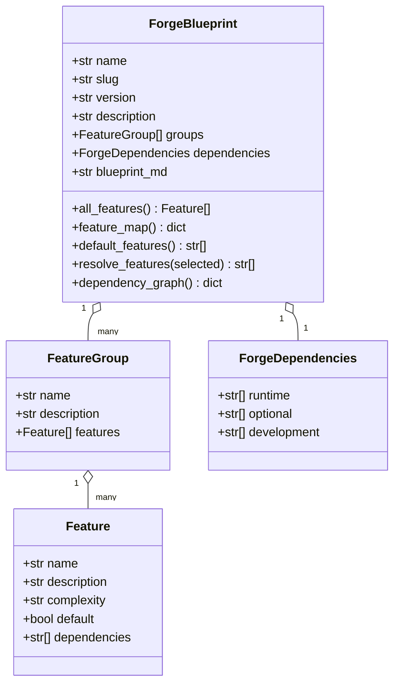
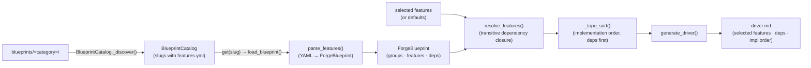
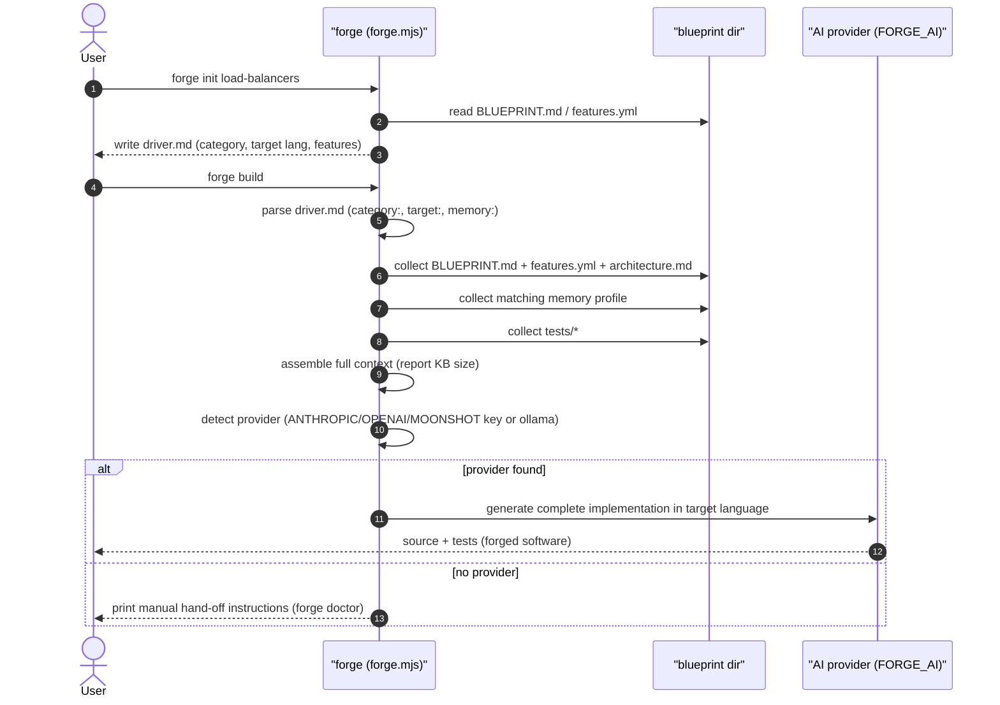
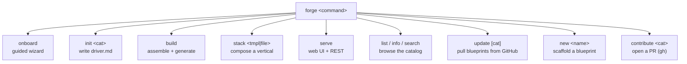
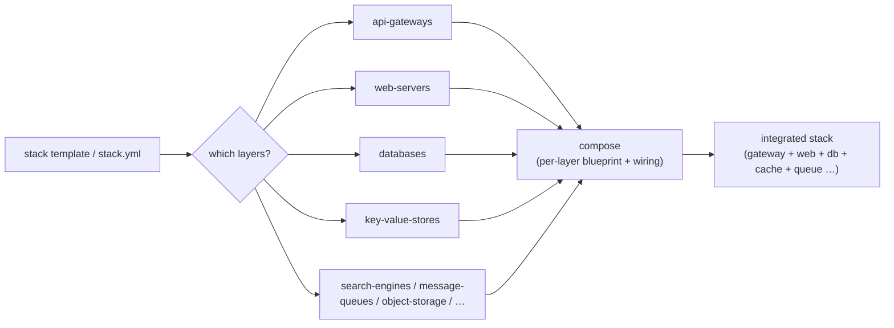
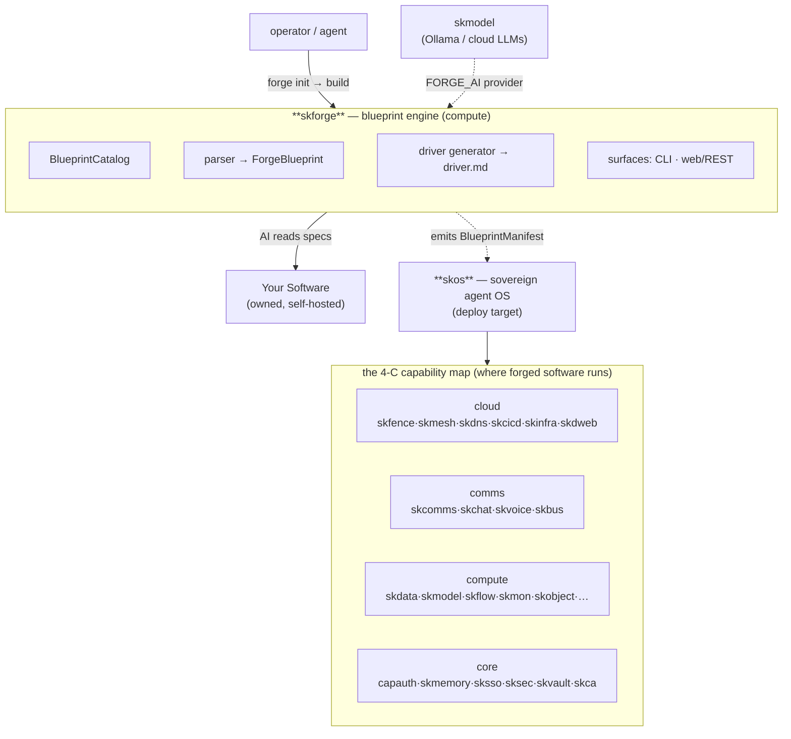

# SKForge Architecture

SKForge is a **blueprint engine**, not an application framework. It turns
structured, language-agnostic *specifications* of software categories into
build-ready instructions an AI code generator can execute. It produces software;
it does not run it.

The whole system is intentionally small and layered:

- **Content** — the blueprints (`blueprints/`), the durable knowledge.
- **Engine** — a tiny Python package (`src/skforge/`) that parses, resolves, and
  renders blueprints programmatically.
- **Surfaces** — a zero-dependency Node CLI (`forge.mjs`) and a web/REST server
  (`cli/serve.mjs`) that wrap the same blueprint model for humans and agents.
- **Generation** — an external LLM (resolved by provider) that reads the assembled
  context and writes the actual code.

Nothing in SKForge imports the rest of SKWorld at runtime. It is *ecosystem-aware*
(it can emit a `skcapstone` `BlueprintManifest` as a deployment target) but
deliberately decoupled — you forge first, deploy later.

---

## The core domain model

A **blueprint** is a directory under `blueprints/<category>/`. Its required file is
`features.yml`; optional companions (`BLUEPRINT.md`, `architecture.md`, `tests/`,
`memory-profiles/`, `deployment/`, `references/`) supply the rich generation context.

`features.yml` parses into a small typed model (`src/skforge/parser.py`, Pydantic):

Each `Feature` declares its own `dependencies` (other feature names). That edge set
is what makes the catalog *composable*: a user selects a few features, and the engine
pulls in everything they transitively require.

---

## Workflow 1 — the Python engine pipeline

The library path (parse → resolve → render) is the canonical pipeline; the CLI is a
front door over the same idea.

Step by step:

1. **Discover** — `BlueprintCatalog` (`catalog.py`) scans the `blueprints/` tree for
   directories containing `features.yml`, skipping `TEMPLATE`, `__pycache__`, `.git`,
   `node_modules`. The result is cached and lazily reloadable.
2. **Parse** — `parse_features()` (`parser.py`) loads `features.yml`, builds
   `FeatureGroup`/`Feature` objects, and normalizes the dependency block (it accepts
   both `"pydantic>=2.0"` strings and `{pydantic: ">=2.0"}` maps). `load_blueprint()`
   also attaches `BLUEPRINT.md` text when present.
3. **Resolve** — `ForgeBlueprint.resolve_features(selected)` validates each name and
   computes the transitive closure of dependencies via an explicit work-stack (no
   recursion), returning a sorted set. Unknown features raise `ValueError`.
4. **Order** — `_topo_sort()` (`driver.py`) orders the resolved set so dependencies
   come first (Kahn's algorithm, alphabetical tie-break; any cycle remnants are
   appended at the end rather than crashing).
5. **Render** — `generate_driver()` writes a Markdown `driver.md`: a header
   (timestamp, slug, version, feature count), the selected features grouped by their
   original group (with `[x]`/`[ ]` markers and *(dependency)* annotations), the
   runtime/optional/development dependency lists, and the numbered implementation
   order with per-feature complexity.

The output `driver.md` is the hand-off artifact: a focused, deterministic spec the
AI consumes alongside the blueprint's prose and tests.

---

## Workflow 2 — the CLI build lifecycle (`forge build`)

The Node CLI (`forge.mjs`) is the interactive surface. `forge onboard` /
`forge init <category>` produce a `driver.md`; `forge build` assembles context and
drives an LLM.

`forge build` reads the `category:`, `target:` (language), and optional `memory:`
profile from `driver.md`, then concatenates the blueprint's `BLUEPRINT.md`,
`features.yml`, `architecture.md`, the matching memory profile, and every test spec
into one context bundle (and reports its size in KB). Provider detection is by
convention: `FORGE_AI` if set, else the first of `ANTHROPIC_API_KEY` /
`OPENAI_API_KEY` / `MOONSHOT_API_KEY`, else a local `ollama`. When no provider is
available it prints copy-paste hand-off instructions instead of failing.

### The full CLI command surface

`list`/`info`/`search` work against both the local `blueprints/` tree and the remote
GitHub catalog (the CLI fetches categories/files over the API and flags remote-only
ones). `update` downloads them locally. `new` scaffolds a blueprint from the
`TEMPLATE`, and `contribute` opens a PR via the `gh` CLI.

---

## Workflow 3 — the Stack Composer (`forge stack`)

Beyond single components, `forge stack` composes a **vertical** — one blueprint per
layer — from named templates or a user `stack.yml`.

Built-in templates include `saas-starter` (gateway · web · db · cache · queue),
`ai-platform`, `enterprise` (a 9-layer production stack adding search, secrets,
container + workflow orchestrators), `notion-killer`, and `zero-trust`. See
[STACKS.md](../STACKS.md) for the full composer documentation.

---

## The web surface (`forge serve`)

`cli/serve.mjs` is a single-file Node HTTP server exposing the same blueprint model
as a REST marketplace plus a SPA (`website/app.html`):

| Endpoint | Returns |
|---|---|
| `GET /api/blueprints` | all blueprint summaries |
| `GET /api/blueprints/:slug` | one blueprint's detail |
| `GET /api/blueprints/:slug/features` | its feature catalog |
| `GET /api/stacks` | available stack templates |
| `GET /api/search?q=` | name/feature search |
| `POST /api/generate-driver` | render a `driver.md` from a selection |

This is the browser-facing mirror of the Python engine's parse/resolve/generate
pipeline.

---

## Source map

| Module | Role |
|---|---|
| `blueprints/<category>/` | the content — `features.yml` (+ `BLUEPRINT.md`, `architecture.md`, `tests/`, `memory-profiles/`, `deployment/`, `references/`) |
| `src/skforge/__init__.py` | package facade + public API (`BlueprintCatalog`, `parse_features`, `generate_driver`, model classes) |
| `src/skforge/parser.py` | YAML → typed `ForgeBlueprint` model; dependency-closure resolution; dependency-list normalization; slugify |
| `src/skforge/catalog.py` | `BlueprintCatalog` — discover / list / get (cached) / search / summary / count / reload |
| `src/skforge/driver.py` | `generate_driver()` (render `driver.md`) + `_topo_sort()` (implementation order) |
| `forge.mjs` | the Node CLI — command dispatcher + `onboard/init/build/stack/serve/list/info/search/update/new/contribute/doctor` |
| `cli/serve.mjs` | web UI + REST marketplace server |
| `cli/forge` | shell-style CLI entry / installer helper |
| `install.sh` | `curl … | sh` installer |
| `tests/test_parser.py` | engine unit tests (`pytest`, `pythonpath = src`) |
| `RECON.md` | the "recipe for making recipes" — how to research a new category into a blueprint |
| `STACKS.md` | Stack Composer reference |
| `TEMPLATE/` (under `blueprints/`) | scaffold used by `forge new` (skipped during discovery) |

---

## Design properties

- **Specification over code.** Blueprints document *patterns*, not source — clean-room
  by construction. The AI writes fresh code from the spec, so generated software is
  yours (Apache-2.0) while the forge stays free (AGPL-3.0).
- **Deterministic resolution.** Feature selection → transitive closure → topological
  order is pure and reproducible; given the same `features.yml` and selection you get
  the same `driver.md`.
- **Minimal coupling.** The engine has two Python dependencies (`pydantic`, `pyyaml`);
  the CLI has none. The only runtime collaborator is the AI provider doing generation.
- **Two surfaces, one model.** CLI, web/REST, and the Python API all sit on the same
  parse/resolve/render core — no logic forks.

---

## Where SKForge lives in SKWorld

SKForge is a **compute**-band capability in the SKWorld 4-C map: the *construction
tool* that produces software for the rest of the stack to run. It deploys forged
software through **skos** (optionally emitting a `skcapstone` `BlueprintManifest` as a
deployment target) and uses **skmodel** — the only live dependency — to reach an LLM
for generation.

See the [README](../README.md#-where-it-lives-in-skstack-v2) for the accessible
overview. In one line: **SKForge forges the software; skos deploys it; the 4 C's run
it.**

---

Part of the **[SKWorld](https://skworld.io)** sovereign ecosystem · 🐧 smilinTux
